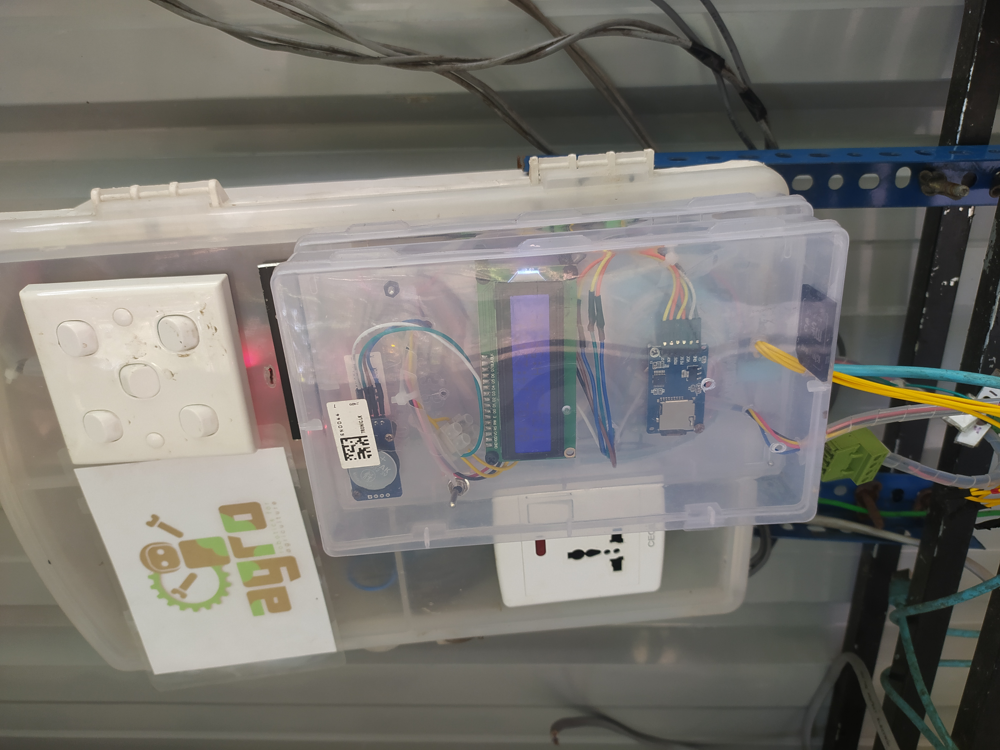

##🌱 𝘼𝙜𝙍𝙤 𝙂𝙧𝙚𝙚𝙣𝙝𝙤𝙪𝙨𝙚 𝘾𝙤𝙣𝙩𝙧𝙤𝙡𝙡𝙚𝙧 𝙑5

  ESP32-Based Smart Greenhouse Monitoring & Control System

  Reliable IoT greenhouse automation system with offline-first architecture and cloud synchronization.
  

📖 Overview

  AgRo Greenhouse V5 is a smart agriculture automation system built using an ESP32 dual-core microcontroller.

  It provides:

    🌡 Real-time environmental monitoring
    
    💧 Intelligent irrigation control
    
    💡 Scheduled lighting management
    
    💾 SD card offline data logging
    
    ☁ Automatic Firebase cloud synchronization
    
    🔄 Dual-core FreeRTOS task management

  Designed for research, prototyping, and scalable smart farming systems.

  🧠 System Architecture
  
  🔹 Core 0

      WiFi monitoring
      
      Automatic reconnection
      
      SD-to-Firebase data synchronization

  🔹 Core 1

      Sensor acquisition
      
      LCD updates
      
      Motor scheduling
      
      Data logging
      
      Lighting control

This separation ensures stable real-time operation even during network instability.

  🛠 Hardware Components

    ESP32 Dev Module
    
    DHT11 Temperature & Humidity Sensor
    
    LDR Light Sensor
    
    DS3231 RTC Module
    
    16x2 I2C LCD
    
    Micro SD Card Module
    
    Relay Module
    
    External Digital Trigger Sensor

  🔌 Pin Configuration
   Function	GPIO
    Motor	2
    
    Fan	16
    
    Relay A4
    
    Light Control	32
    
    DHT11	14
    
    LDR	36
    
    SD Card (CS)	5
    
    SensorC Input	13
  
  ⚙️ Key Features
  🌡 Environmental Monitoring

    Temperature & humidity (DHT11)
    
    Light intensity mapped to percentage
    
    Real-time timestamp from DS3231

  💾 Offline-First Logging

    Logs hourly to: /datalog.txt

  Ensures zero data loss during internet outages.

  ☁ Firebase Cloud Sync

  When WiFi reconnects:

  * Reads stored data

  * Uploads to Firebase using HTTP PUT

  * Cleans processed entries

  * Resumes normal operation

 Example Data Format
 
      {
        "temperature": 28.4,
        "humidity": 74.1,
        "light": 63
      }
    
 Entry key format:

    YYYYMMDD_HHMMSS

💧 Intelligent Irrigation Logic

  Runs every:
  
    1 hour (default)
    
    2 hours (if external sensor active)

  Each cycle:
  
    30 seconds ON
    
    Additional runs at +5, +10, +15 minutes

  Night safety lock:

    Disabled between 21:00 – 07:00

💡 Scheduled Lighting

    Automatically enabled between: 18:00 – 22:00

🔐 Reliability Design

    Automatic WiFi reconnection
    
    SD fallback storage
    
    Non-blocking FreeRTOS tasks
    
    Controlled sending-only mode during cloud sync
    
    Power-loss safe RTC recovery

📸 Hardware Assembly

    System enclosed in a mounted control unit including:
    
    LCD interface
    
    RTC module
    
    SD logging module
    
    Relay-controlled actuators
    
    ESP32 controller
    
    Designed for protected greenhouse deployment.

📈 Future Improvements

    Upgrade to DHT22 / BME280
    
    Add soil moisture sensing
    
    ESP32 Web Dashboard
    
    OTA firmware updates
    
    MQTT protocol integration
    
    Mobile monitoring app

🎓 Educational Value

This project demonstrates:

    Dual-core FreeRTOS architecture
    
    Offline-first IoT system design
    
    Cloud data synchronization logic
    
    Embedded task scheduling
    
    Reliable agricultural automation
